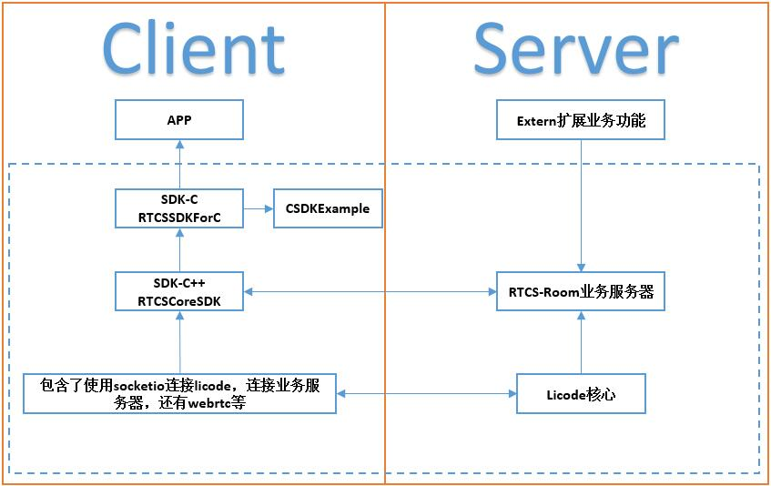

# RTCS

#### 介绍
该项目包含了一个简单的基于webrtc的视频会议客户端和服务器系统，可以充分满足公司团队或个人的视频会议需求。

该项目客户端主要基于webrtc-native开源代码，服务器SFU部分基于licode开源视频服务器。整体项目结构图如下图所示。

如图所示，该项目包含的各个部分分模块介绍如下： 
Server端： 
 
[Licode](https://github.com/lynckia/licode)是本项目使用的流媒体传输SFU 
 
[RTCS-Room业务服务器](https://github.com/jerremyfly/RTCS/tree/master/rtcs-room)是自定义的业务服务器，负责与核心licode服务器交互http接口，与客户端RTCSCoreSDK有TCP长连接。提供了业务上的登录等功能，定义扩展业务功能接口，方便实现自定义业务功能。如APP对应的Extern扩展业务功能就是继承的RTCS-Room业务服务器定义的接口。 
 
[Extern扩展业务功能]()对应自定义开发业务需要扩展的业务功能模块，主要实现继承RTCS-ROOM业务服务器定义的接口。 
 
Client端： 
 
[RTCSCoreSDK]()(--待开源)是对外提供C++接口的SDK库，适配了webrtc和licode，以及所有音视频相关操作，会议房间登录等都在该sdk完成。 
 
[RTCSSDKForC]()(--待开源)是对外提供C接口的SDK库，主要封装了RTCSCoreSDK的c++接口，方便其他语言开发。用户只需关注接口的调用，而不用关心底层代码的管理，可以集中精力放在自己系统的业务逻辑和UI上，简单、灵活、高效的接口操作，极大的方便用户二次开发音视频相关应用。 
 
[CSDKExample](https://github.com/jerremyfly/RTCS/tree/master/sample/CSDKExample)是基于RTCSSDKForC这个C接口开发的Example，使用Qt开发。演示了所有接口的操作和使用方式，开发自定义业务系统可以参考此系统完成。 
 
[APP]()自定义业务开发的系统，基于RTCSSDKForC，对应的服务器业务为Extern扩展业务功能。 
 

#### 使用说明

1. xxxx
2. xxxx
3. xxxx

